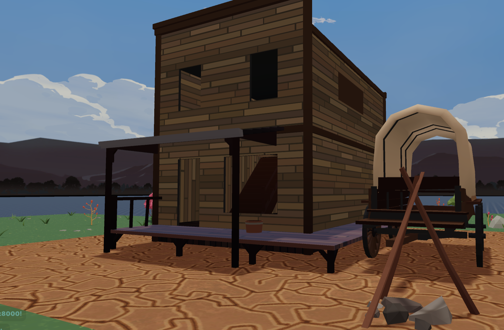

# Simple Example with dcl-access library

 A simple example that shows how you can use DCL Access library to restrict access to players to a part of your scene




This scene shows you:

- How to block players who don't own a certain token from entering an area
- How to block players who don't own a certain token from entering an area
- How to block players who don't aren't currently wearing a certain wearable from entering an area


## Try it out

**Install the CLI**

Download and install the Decentraland CLI by running the following command:

```bash
npm i -g decentraland
```

**Previewing the scene**

Download this example and navigate to its directory, then run:

```
$:  dcl start
```

Any dependencies are installed and then the CLI opens the scene in a new browser tab.
Learn more about how to build your own scenes in our [documentation](https://docs.decentraland.org/) site.

If something doesn’t work, please [file an issue](https://github.com/decentraland-scenes/Awesome-Repository/issues/new).

## Copyright info

This scene is protected with a standard Apache 2 licence. See the terms and conditions in the [LICENSE](/LICENSE) file.
